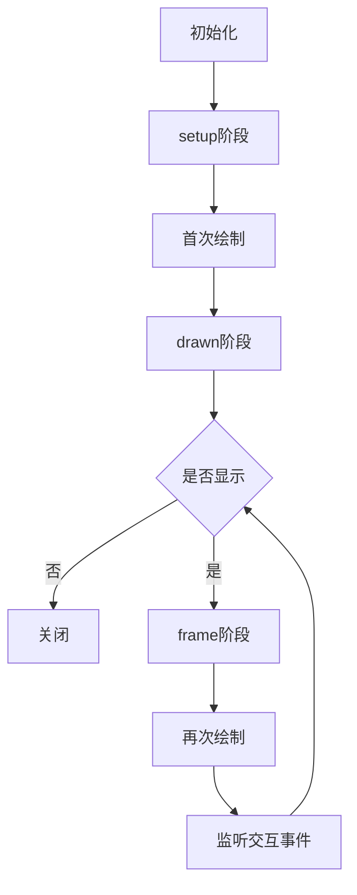

# PsychoPy-Scene


[English](README.md) | 简体中文

本项目是基于 [PsychoPy](https://github.com/psychopy/psychopy) 的轻量级实验框架，源码 **<300 行**。

> [!NOTE]
> 本项目旨于提供构建 PsychoPy 实验的新方式，仅提供最基础的 API，并鼓励开发者对本项目进行二次开发。

## 特性

- 轻量级：只有一个文件，无额外依赖项
- 类型安全：所有参数均使用类型注解
- 新人友好：仅需掌握 `Context` 和 `Scene` 的概念即可上手

## 安装

```bash
pip install psychopy-scene
```

或直接复制 `psychopy_scene` 文件夹到项目根目录。

## 使用

### 实验上下文

实验上下文 `Context` 表示实验的全局参数，包括环境参数、任务参数等。
编写实验的第一步，就是创建实验上下文。

```python
from psychopy_scene import Context
from psychopy.visual import Window
from psychopy.monitors import Monitor

# create monitor
monitor = Monitor(
    name="testMonitor",
    width=52.65,
    distance=57,
)
monitor.setSizePix((1920, 1080))

# create window
win = Window(
    monitor=monitor,
    units="deg",
    fullscr=False,
    size=(800, 600),
)

# create experiment context
ctx = Context(win)
```

### 画面

实验可以被当作一系列画面 `Scene` 的组合，编写实验程序只需要 2 步：

1. 创建画面
2. 编写画面呈现流程

我们可以把需要绘制的若干个刺激传入 `Scene` 方法中，这些刺激将被自动绘制：

```python
from psychopy.visual import TextStim

# create stimulus
stim_1 = TextStim(win, text="Hello")
stim_2 = TextStim(win, text="World")
# create scene
scene = ctx.Scene(stim_1) # draw stim_1
scene = ctx.Scene([stim_1, stim_2]) # draw stim_1 and stim_2
# show scene
scene.show()
```

画面有 2 个配置方法，每个方法只应调用一次。
`duration` 方法设置呈现时间（秒），`close_on` 方法设置关闭画面的[按键](#按键)：

```python
scene = ctx.Scene(stim).duration(1).close_on("f", 'j')
```

有些画面的呈现时间是不固定的，这时我们可以通过[状态管理](#状态管理)动态设置呈现时间：

```python
scene = ctx.Scene(stim).duration()
scene.show(duration=1)
```

不同的画面可能需要绘制同一类刺激，比如指导语和结束语这 2 个画面都需要呈现文本。
这时我们只需要创建 1 个文本刺激，再使用 `hook` 方法向画面的特定阶段添加自定义函数，
这个函数被称为[生命周期](#生命周期) 钩子。
在下面的示例中，指导语和结束语使用同 1 个刺激绘制了不同的文本，
这是因为被添加到 `setup` 阶段的钩子将在画面**首次绘制前**被执行。

```python
# this is equivalent to:
# guide = ctx.Scene(stim).hook('setup')(lambda: stim.text = "Welcome to the experiment")
@(ctx.Scene(stim).hook('setup'))
def guide():
    # change stimulus parameters before first drawing
    stim.text = "Welcome to the experiment"

@(ctx.Scene(stim).hook('setup'))
def end():
    # change stimulus parameters again, becasue this scene will show another text
    stim.text = "Thanks for your participation"

guide.show()
end.show()
```

通过这种机制，我们可以很灵活地绘制刺激。要想绘制动态刺激，就在 `frame` 阶段添加生命周期钩子：

```python
from psychopy import core

@(ctx.Scene(stim).hook('frame'))
def scene():
    stim.text = f"Current time is {core.getTime()}"

scene.show()
```

### 状态管理

很多时候，我们需要呈现一系列画面，这些画面需要绘制同一类刺激，但绘制的内容不同。
这时，我们可以将这种在画面每次呈现时都需要变化的参数称为画面的 **状态**：

```python
@(ctx.Scene(stim).duration(0.1).hook('setup'))
def scene():
    stim.text = scene.get("text") # get `text` state

for instensity in ['A', 'B', 'C']:
    scene.show(text=instensity) # set `text` state and show
```

> [!NOTE]
> 每次调用 `show` 方法都会在初始化阶段 **重置状态**，所以应该通过 `show` 方法设置初始状态。
> 详见 [生命周期](#生命周期)。

#### 内置状态

有些状态是由画面的方法自动设置的：

| 状态          | 描述             | 画面方法 |
| ------------- | ---------------- | -------- |
| show_time     | 开始显示的时间戳 | show     |
| close_time    | 结束显示的时间戳 | show     |
| duration      | 持续时间         | duration |
| keys          | 被按下的按键     | close_on |
| response_time | 按下按键的时间戳 | close_on |

### 处理交互

大多数情况中，使用 `close_on` 方法配置关闭画面的按键已经绰绰有余。
如果我们还想在被试按键后执行一些额外操作，可以使用 `on` 方法为不同按键添加自定义函数，
这些函数被称为事件监听器，参考 [wiki](https://en.wikipedia.org/wiki/Publish%E2%80%93subscribe_pattern)：

```python

# add listener for keys, listener will be executed when corresponding key is pressed
ctx.Scene().on(
    space=lambda e: print(f"space key was pressed, this event is: {e}"),
    mouse_left=lambda e: print(f"left mouse button was pressed, this event is: {e}"),
)
```

需要注意的是，1 个按键只能有 1 个监听器，后添加的监听器会覆盖之前的监听器：

```python
# only the last listener will be emitted when multiple listeners are added for the same key
ctx.Scene().on(
    space=lambda e: print("this listener won't be executed")
).on(
    space=lambda e: print("this listener will be executed")
)

# when `f` is pressed, the scene won't be closed
ctx.Scene().close_on("f", "j").on(
    f=lambda e: print("this listener will cover `close_on` listener")
)
```

每个监听器都需要接收一个事件对象，其包含了触发事件的画面和监听到的按键：

```python
ctx.Scene().on(
    space=lambda e: print(f"this scene is: {e.target}; pressed keys are: {e.keys}")
)
```

#### 按键

- 键盘：和 `keyboard.getKeys()` 的返回值一样
- 鼠标：`mouse_left`、`mouse_right`、`mouse_middle`

### 数据收集

PsychoPy 推荐的数据收集方式是使用 `ExperimentHandler`。
现在我们可以使用 `ctx.addLine` 进行数据收集，并通过 `ctx.expHandler` 访问 `ExperimentHandler` 实例。

```python
# it will call `ctx.expHandler.addData` and `ctx.expHandler.nextEntry` automatically
ctx.addLine(correct=..., rt=...)
```

正如 [状态管理](#状态管理) 部分所说，有些交互数据是由 `close_on` 自动收集的。
如果我们使用了 `close_on` 方法，可以在 `show` 方法执行后获取这些状态：

```python
scene = ctx.Scene().close_on("f", "j")
scene.show()

keys = scene.get("keys") # KeyPress or str
response_time = scene.get("response_time") # float
```

当然，我们也可以像 [处理交互](#处理交互) 部分那样，手动添加监听器：

```python
scene = ctx.Scene().on(space=lambda e: scene.set(rt=core.getTime() - scene.get("show_time")))
scene.show()

rt = scene.get("rt") # float
```

### 生命周期

使用 `show` 方法将画面呈现到屏幕上时，需要经过一系列步骤：
重置并初始化状态、清理事件缓冲、绘制刺激、记录开始显示时间等，
这一整个过程被称为画面的生命周期。
在这个过程中，同时会执行生命周期钩子，让我们可以在画面呈现的特定阶段执行一些自定义操作：

| 阶段  | 执行时机   | 通常用法     |
| ----- | ---------- | ------------ |
| setup | 首次绘制前 | 设置刺激参数 |
| drawn | 首次绘制后 | 执行耗时任务 |
| frame | 逐帧       | 更新刺激参数 |

生命周期图示：



## 最佳实践

### 上下文和任务分离

推荐以函数形式编写任务，将实验上下文作为第一参数传入，其余参数作为任务的特有参数，并返回实验数据。

```python
from psychopy_scene import Context

def task(ctx: Context, duration: float):
    from psychopy.visual import TextStim

    stim = TextStim(ctx.win, text="")
    scene = ctx.Scene(stim).duration(duration)
    scene.show()
    return ctx.expHandler.getAllEntries()
```

### 只关注任务相关的逻辑

任务函数不应包含任何与任务本身无关的逻辑，例如：

- 指导语和结束语
- block 数量
- 数据处理、分析、结果展示

如果 block 间不存在数据依赖的话，建议一个任务函数只呈现一个 block。
对于需要呈现多个 block 的实验，考虑以下示例：

```python
from psychopy_scene import Context
from psychopy.visual import Window

def task(ctx: Context):
    from psychopy.visual import TextStim

    stim = TextStim(ctx.win, text="")
    scene = ctx.Scene(stim).duration(0.2)
    scene.show()
    return ctx.expHandler.getAllEntries()

win = Window()
data = []
for block_index in range(10):
    ctx = Context(win)
    ctx.expHandler.extraInfo['block_index'] = block_index
    block_data = task(ctx)
    data.extends(block_data)
```

### TrialHandler 和任务分离

得益于 PsychoPy 的封装，我们可以很方便地控制下一个 trial。

```python
from psychopy.data import TrialHandler

handler = TrialHandler(trialsList=['A', 'B', 'C'], nReps=1, nTrials=10)
for trial in handler:
    trial # except: 'A" or 'B' or 'C'
```

为了 trial 迭代器和任务函数的分离，本库提供了 `ctx.handler` 属性。
它可以用来控制下一个 trial，并将 trial 相关的数据收集到 `ctx.expHandler` 中。
我们只需要在创建上下文时设置 `handler` 参数即可。

```python
from psychopy_scene import Context
from psychopy.visual import Window
from psychopy.data import TrialHandler

def task(ctx: Context):
    from psychopy.visual import TextStim

    stim = TextStim(ctx.win, text="")
    @(ctx.Scene(stim).duration(0.2).hook('setup'))
    def scene():
        stim.text = scene.get("text")
    for instensity in ctx.handler:
        scene.show(text=instensity)
    return ctx.expHandler.getAllEntries()

ctx = Context(
    Window(),
    handler=TrialHandler(trialsList=['A', 'B', 'C'], nReps=1, nTrials=10),
)
data = task(ctx)
```

但是，当我们打算使用 `StairHandler` 并访问 `ctx.handler.addResponse` 时，
Pylance 类型检查器会报错。
这是因为 `ctx.handler` 的类型并没有 `addResponse` 方法，
为了解决这个问题，我们可以使用 `ctx.responseHandler` 替代 `ctx.handler`。

> [!WARNING]
> 如果在运行时 `ctx.handler` 没有 `addResponse` 方法，
> 访问 `ctx.responseHandler` 将会抛出异常。
> 所以在使用 `ctx.responseHandler` 时，请确保传入的 `handler` 参数有 `addResponse` 方法。
