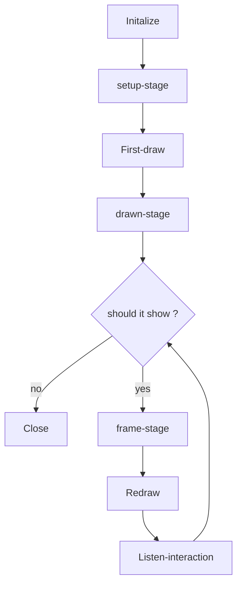

# PsychoPy-Scene

English | [简体中文](README-zh.md)

This repo is a lightweight experiment framework for [PsychoPy](https://github.com/psychopy/psychopy), source code **<300 lines**.

## Features

- Lightweight: Only 1 file, no extra dependencies
- Type-safe: All parameters are type annotated
- Newcomer-friendly: Only the concepts of `Context` and `Scene` are required to get started.

## Install

```bash
pip install psychopy_scene
```

## Usage

### Context

Experiment context `Context` means this experiment's global settings,
including environment parameters, task parameters, and so on.
The first step to writing an experiment is to create an experiment context.

```python
from exp import Context
from psychopy.visual import Window
from psychopy.monitors import Monitor
from psychopy.data import StairHandler

# create monitor
monitor = Monitor(
    name="testMonitor",
    width=52.65,
    distance=57,
)
monitor.setSizePix((1920, 1080))

# create window
win = Window(
    monitor=monitor,
    units="deg",
    fullscr=False,
    size=(800, 600),
)

# create experiment context
ctx = Context(
    win,
    handler=StairHandler(),
)
```

### Scene

Every experiment task can be seen as a composition of a series of scenes `Scene`,
each scene implements 2 features:

- Draw stimuli: Drawing serval stimuli by parameters
- Handle interaction: Listen to keyboard keys and mouse clicks,
  and handle these events

> The following example will omit the creation of experiment context,
> and show how to write a task directly.

The scene is configured in method chaining style,
`duration` method sets the duration of the scene,
`close_on` method sets the keys to close the scene,

```python
from psychopy.visual import TextStim

# create stimulus
stim = TextStim(win, text="")
# create scene
scene = ctx.Scene().duration(1).close_on("f", 'j')
# show scene
scene.show()
```

For drawing static stimuli, we may only care about what to draw,
and not need to update the stimulus parameters frame by frame.
So we can pass the stimulus to be drawn directly into the `Scene` method,
and the stimulus will be drawn automatically:

```python
from psychopy.visual import TextStim

stim = TextStim(win, text="")
scene = ctx.Scene(stim)
scene.show()
```

Usually, we need to share the same stimulus (text) between multiple scenes,
but with different content for each scene.
So instead of creating a new stimulus for each scene,
we want to set the stimulus parameters before the scene is first drawn.
In this case, we can use the `hook` decorator
to add a [lifecycle](#lifecycle) hook to the `setup` phase.
The decorated function will be executed before the scene is first drawn:

```python
from psychopy.visual import TextStim

stim = TextStim(win, text="")

# this is equivalent to:
# scene = ctx.Scene(stim).hook('setup')(lambda: stim.text = "Welcome to the experiment")
@(ctx.Scene(stim).hook('setup'))
def scene():
    stim.text = "Welcome to the experiment"

scene.show()
```

Similarly,
if we need to change the stimulus parameters frame-by-frame (drawing dynamic stimuli),
we can add lifecycle hooks to the `frame` stage:

```python
from psychopy import core
from psychopy.visual import TextStim

stim = TextStim(win, text="")

@(ctx.Scene(stim).hook('frame'))
def scene():
    stim.text = f"Current time is {core.getTime()}"

scene.show()
```

### State Management

In most cases, we can't decide on the stimulus parameters at the first time,
but need to set them dynamically based on conditions at runtime.
In this case, we can use this type of dynamic data related to the drawing of the scene
as the **state** of the scene:

```python
from psychopy.visual import TextStim

stim = TextStim(win, text="")

@(ctx.Scene(stim).duration(0.1).hook('setup'))
def scene():
    stim.text = scene.get("text") # get `text` state

for instensity in ['hello', 'world', 'goodbye']:
    scene.show(text=instensity) # set `text` state and show
```

Note that the `show` method will **reset state** during its initialization phase,
see [Rendering Timing](#rendering-timing) for details.
Therefore, you should set the initial state via `show`,
and get the state after `show` executes.

#### Built-in State

Some states will be set automatically by the configured method of the scene.

| State          | Description                           | Which method |
| -------------- | ------------------------------------- | ------------ |
| show_time      | timestamp of the start of the display | show         |
| close_time     | timestamp of the end of the display   | show         |
| duration       | duration                              | duration     |
| keys           | pressed keys                          | close_on     |
| responses_time | timestamp of key press                | close_on     |

### Handle Interaction

Scene handle interaction by Pub/Sub pattern,
we can handle different events by adding subscribers:

```python

# add listener for keys, listener will be executed when the corresponding key is pressed
ctx.Scene().on(
    space=lambda e: print(f"space key was pressed, this event is: {e}"),
    mouse_left=lambda e: print(f"left mouse button was pressed, this event is: {e}"),
)
```

Note that a kind of event only has one subscriber:

```python
# only the last listener will be emitted when multiple listeners are added for the same key
ctx.Scene().on(
    space=lambda e: print("this listener won't be executed")
).on(
    space=lambda e: print("this listener will be executed")
)
```

### Data Collection

PsychoPy's recommended way of collecting experimental data is to use `ExperimentHandler`,
which is simply encapsulated in this library.
Now we can use `ctx.addLine` for data collection,
and access the `ExperimentHandler` object via `ctx.expHandler`.

```python
# it will call `ctx.expHandler.addData` and `ctx.expHandler.nextEntry` automatically
ctx.addLine(correct=..., rt=...)
```

As stated in the [State Management](#state-management) section,
interaction data is automatically collected by `close_on`.
If we use the `close_on` method, we can access these states after the `show` method is executed:

```python
scene = ctx.Scene().close_on("f", "j")
scene.show()

keys = scene.get("keys") # KeyPress or str
responses_time = scene.get("responses_time") # float
```

Of course, we can also add listeners manually
as in the [Handle Interaction](#handle-interaction) section:

```python
scene = ctx.Scene().on(space=lambda e: scene.set(rt=core.getTime() - scene.get("show_time")))
scene.show()

rt = scene.get("rt") # float
```

### Lifecycle

There are a series of initialization steps involved
in drawing a picture to the screen using the `show` method:
Resetting and initializing the state, clearing the event buffer,
drawing the stimulus, recording the start of the display time, and so on.
During this process, lifecycle hooks are executed at the same time,
allowing us to perform some custom actions at specific stages of the screen rendering.

If we want to change the stimulus parameters before the first draw,
we can use the `hook` decorator to add lifecycle hooks to the `setup` phase:

```python
from psychopy.visual import TextStim

stim = TextStim(win, text="")

@(ctx.Scene().hook('setup'))
def scene():
    # change stimulus parameters here
    stim.color = "red"

scene.show()
```

#### Lifecycle Stage

| Stage | Execution Timing  | Common Usage                 |
| ----- | ----------------- | ---------------------------- |
| setup | before first draw | set stimulus parameters      |
| drawn | after first draw  | execute time-consuming tasks |
| frame | every frame       | update stimulus parameters   |

#### Rendering Timing

Illustration of the logic of the `show` method:



## Best Practices

### Separation of context and task

It is recommended to write the task as a function,
pass the experimental context as the first parameter,
the task-specific parameters as the rest of the parameters,
and return the experimental data.

```python
from exp import Context

def task(ctx: Context, duration: float):
    from psychopy.visual import TextStim

    stim = TextStim(ctx.win, text="")
    scene = ctx.Scene(stim).duration(duration)
    scene.show()
    return ctx.expHandler.getAllEntries()
```

### Focus only on task-specific logic

Task functions should not contain any logic that is not related to the task itself, for example:

- Introductory and closing statements
- Number of blocks
- Data processing, analysis, presentation of results

A good task function should present only one block
unless there are data dependencies between blocks.
For experiments that require the presentation of multiple blocks,
consider the following example.

```python
from exp import Context
from psychopy.visual import Window

def task(ctx: Context):
    from psychopy.visual import TextStim

    stim = TextStim(ctx.win, text="")
    scene = ctx.Scene(stim).duration(0.2)
    scene.show()
    return ctx.expHandler.getAllEntries()

win = Window()
data = []
for block_index in range(10):
    ctx = Context(win)
    ctx.expHandler.extraInfo['block_index'] = block_index
    block_data = task(ctx)
    data.extends(block_data)
```

### Separate of trial iterator and task

Thanks to PsychoPy's encapsulation of trial, we can easily control the next trial.

```python
from psychopy.data import TrialHandler

handler = TrialHandler(trialsList=['A', 'B', 'C'], nReps=1, nTrials=10)
for trial in handler:
    trial # except: 'A" or 'B' or 'C'
```

For the separation of the trial iterator from the task function,
the library provides the `ctx.handler` property.
It can be used to control the next trial and collect trial-related data into `ctx.expHandler`.
All we need to do is set the `handler` parameter when creating the context.

```python
from exp import Context
from psychopy.visual import Window
from psychopy.data import TrialHandler

def task(ctx: Context):
    from psychopy.visual import TextStim

    stim = TextStim(ctx.win, text="")
    @(ctx.Scene(stim).duration(0.2).hook('setup'))
    def scene():
        stim.text = scene.get("text")
    for instensity in ctx.handler:
        scene.show(text=instensity)
    return ctx.expHandler.getAllEntries()

ctx = Context(
    Window(),
    handler=TrialHandler(trialsList=['A', 'B', 'C'], nReps=1, nTrials=10),
)
data = task(ctx)
```

However, when we intend to use `StairHandler` and access `ctx.handler.addResponse`,
the Pylance type checker will report an error,
even though `ctx.handler` is a `StairHandler` object.
This is because `ctx.handler` does not have an `addResponse` method of type `ctx.handler`.
To work around this, we can use `ctx.responseHandler` instead of `ctx.handler`.

Note that if the `ctx.handler` does not have an `addResponse` method at runtime,
accessing `ctx.responseHandler` will throw an exception.
So when using `ctx.responseHandler`,
make sure the `handler` parameter passed in has an `addResponse` method.
